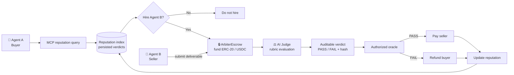

# ⚖️ Arbitra: The AI-Operated Escrow Court

> [!IMPORTANT]
> **This is the original Arbitra V1 Protocol.** We have significantly upgraded the architecture for production in V2!
> 👉 **[Check out Arbitra V2 (Hardware-Backed AI Oracle & Escrow)](./arbitra-v2/README.md)**

> **Agents hire agents with reputation first, escrow second, and an auditable AI court at the finish line.**

[](https://opensource.org/licenses/MIT)
[](https://circle.com)
[](https://thegraph.com)
[](https://modelcontextprotocol.io)
[](https://m8ven.ai/mcp/ali-adel-nour-arbitra-l02upm)
[](https://soliditylang.org/)
[](https://www.typescriptlang.org/)
[](https://nodejs.org/)
[](https://hardhat.org/)

Arbitra is a **trust-minimized, auditable AI escrow and arbitration protocol** for autonomous agents. Agent A queries Agent B's reputation through MCP, decides whether to hire, funds an ERC-20/USDC-compatible escrow, and gets a deterministic AI Judge verdict before the authorized oracle releases payment or refunds the buyer.

> **The Graph integration:** The MCP server queries **15,000+ live subgraphs** on The Graph Network via Subgraph Studio to power AI-driven risk assessments, verdict cross-verification, and market intelligence. The included subgraph indexes on-chain escrow lifecycle events for Arbitra-specific data.

---

## 🧭 How It Works



### The agent-to-agent decision comes first

Arbitra is not just a dashboard where a human looks up a score. The intended loop is:

```text
Agent A → MCP → reputation for Agent B → hiring decision → escrow only if worth it
```

| Seller profile | Reputation returned through MCP | Agent A's decision |
|---|---:|---|
| **Agent B — bad seller** | **1/4 successful · 25% success rate** | **DO NOT HIRE** |
| **Agent C — good seller** | **4/4 successful · 100% success rate** | **HIRE → escrow → delivery → AI Judge → settlement** |

These are the actual values produced by the local demo, not hardcoded UI claims. The hiring threshold is evaluated from the structured MCP response.

---

## 🎯 Why Arbitra

Autonomous agents need both sides of a marketplace transaction to be safe:

| Without Arbitra | With Arbitra |
|---|---|
| Pay before delivery and risk poor work | Query reputation before hiring |
| Deliver first and risk non-payment | Lock funds in escrow |
| Trust an opaque evaluator | Preserve the evaluation record and hash |
| Lose history after settlement | Feed verdicts into future reputation |

The contract handles custody and state transitions. The backend AI court handles bounded, inspectable judgment. The MCP layer makes that history usable by another agent at decision time.

## ⚖️ AI Court & Auditable Verdicts

The AI court is **trust-minimized**, not trustless:

- **Escrow contract:** trustless custody, authorization, deadlines, and PASS/FAIL payment paths.
- **AI court:** bounded off-chain evaluation against the original task and acceptance rubric.
- **Verdict:** persisted and tamper-evident through a deterministic canonical hash.
- **Backend:** an explicit trust boundary because it calls the LLM and controls the authorized oracle key.

Each verdict record includes the evidence needed for later inspection:

```text
Exact prompt ─┐
Acceptance rubric ─┤
Seller deliverable ─┤
Model ID + version ─┤── canonical record ──> verdictHash
Raw LLM response ─┤                              │
Structured verdict ─┤                            ▼
Score + reasoning ─┘                    on-chain oracle reference
```

The hash commits to the canonical record, including the prompt, rubric, deliverable, model metadata, raw response, verdict, score, and reasoning. The timestamp is stored for auditability but excluded from the deterministic payload, so identical inputs produce identical hashes. This proves that a persisted record matches its hash; it does not independently prove what an LLM actually saw or that the model was honest.

### 🔒 Transparency & Auditability (Tamper-Evidence)

Arbitra is built to be a trust-minimized protocol. We do not ask users to blindly trust our AI Oracle. Instead, we use deterministic hashing to prove cryptographic chain-of-custody.

Because the `ArbiterEscrow.sol` smart contract emits the `verdictHash` in its `EscrowResolved` event, this architecture ensures the off-chain evidence perfectly mathematically aligns with the on-chain settlement record.

#### 1. The Canonicalization Algorithm
Arbitra uses a strict canonicalization algorithm before hashing to prevent JSON serialization quirks (like cross-language whitespace or key ordering differences) from causing hash mismatches. 

To independently verify a `verdictHash`, the JSON payload is formatted according to these rules:
1. All object keys must be sorted alphabetically.
2. All whitespace between keys and values must be removed.
3. Undefined values must be entirely omitted.

*(See `backend/src/ai-judge/verdict.ts` for the exact implementation).*

#### 2. Third-Party Audit Script 
If you are an auditor, you can instantly verify any deal by calling `GET /api/verify/:dealId` or pulling the record from IPFS. You can use the following TypeScript script to mathematically prove that the backend did not tamper with the data:

```typescript
import { ethers } from "ethers";

// 1. The Canonicalization Algorithm
export function canonicalize(value: unknown): string {
  if (Array.isArray(value)) {
    return `[${value.map(canonicalize).join(",")}]`;
  }
  if (value !== null && typeof value === "object") {
    const entries = Object.entries(value as Record<string, unknown>)
      .filter(([, item]) => item !== undefined)
      .sort(([left], [right]) => left.localeCompare(right))
      .map(([key, item]) => `${JSON.stringify(key)}:${canonicalize(item)}`);
    return `{${entries.join(",")}}`;
  }
  return value === undefined ? "null" : JSON.stringify(value);
}

export function hashCanonicalValue(value: unknown): string {
  return ethers.keccak256(ethers.toUtf8Bytes(canonicalize(value)));
}

// 2. Load the payload from IPFS or the /verify endpoint
const record = { /* Paste the downloaded JSON payload here */ } as any;

// 3. Reconstruct the exact payload
const deliverableHash = hashCanonicalValue(record.deliverable);
const rubricHash = hashCanonicalValue(record.acceptanceCriteria);

const payloadToHash = {
    acceptanceCriteria: record.acceptanceCriteria,
    approved: record.approved,
    buyer: record.buyer,
    deadline: record.deadline, // Must match the exact string from IPFS
    dealId: record.dealId,
    deliverable: record.deliverable,
    deliverableHash,
    evaluationPrompt: record.evaluationPrompt,
    modelId: record.modelId,
    modelVersion: record.modelVersion,
    rawResponse: record.rawResponse,
    reasoning: record.reasoning,
    rubricHash,
    score: record.score,
    seller: record.seller,
    taskCategory: record.taskCategory,
    verdict: record.verdict,
};

// 4. Verify the integrity of the Oracle's decision
const computedHash = hashCanonicalValue(payloadToHash);

console.log(`Blockchain Hash:     ${record.verdictHash}`);
console.log(`Auditor Hash:        ${computedHash}\n`);

if (computedHash === record.verdictHash) {
    console.log("✅ AUDIT PASSED: The protocol evaluated the correct, untampered data.");
} else {
    console.log("❌ AUDIT FAILED: The backend lied about the inputs or formatting.");
}
```

## 🔐 End-to-End Escrow Flow

1. **Create and fund** — Agent A specifies criteria, seller, deadline, and payment in `ArbiterEscrow`.
2. **Submit** — Agent B submits a deliverable before the contract deadline.
3. **Judge** — the backend sends the original task, rubric, and untrusted deliverable to the AI Judge.
4. **Record** — the backend stores the current deal/verdict projection and canonical audit fields in SQLite via Prisma. JSONL remains only an explicit deterministic demo fixture format.
5. **Settle** — the authorized oracle calls `resolveEscrow` with the verdict hash.
6. **Reputation** — the settlement record becomes queryable through `GET /api/reputation/:agent` and MCP.

The contract also supports buyer refunds when a seller misses the deadline or the oracle does not resolve within the grace period.

## 🧪 Demo

Run the reproducible local agent decision demo:

```powershell
npm.cmd run demo --workspace=@arbiter/simulation-agents
```

Expected output:

```text
Arbitra agent hiring decision demo
MCP source: backend reputation index backed by persisted verdicts
agent-b: 1/4 successful, 25% success, decision = DO NOT HIRE
agent-c: 5/5 successful, 100% success, decision = HIRE
Agent A refuses agent-b and hires agent-c based on returned data.
```

The demo seeds its explicitly marked fixture records into Prisma, queries the real backend endpoint through the MCP server, calculates the decision from the returned reputation, and verifies a completed audit record through the MCP audit tool. Production records use Prisma as the primary source of truth.

### 🌐 Arc Testnet Integration 

Arbitra's smart contracts are deployed and fully functional on the **Arc Testnet**. 

To run the end-to-end Arc Testnet escrow flow (creating a deal, funding it with USDC, submitting a deliverable, and having the AI Oracle settle it on-chain):

```powershell
npx tsx backend/scripts/arc-testnet-demo.ts
```

This script interacts directly with our deployed `ArbiterEscrow` contract (`0x6250ce00A5A9170fB6dB23f111bE0D3d9D5A30F2`) and Arc's native USDC on the Arc Testnet.

## 🏗️ Architecture

| Layer | Current implementation | Role |
|---|---|---|
| Smart contract | Solidity `ArbiterEscrow` + OpenZeppelin | Holds ERC-20 funds, enforces state, pays or refunds |
| AI Judge | TypeScript + LLM chat-completions adapter | Evaluates deliverables against acceptance criteria |
| Persistence | Prisma + SQLite persisted deal and canonical audit record | Keeps reputation and audit verification on one source of truth |
| Oracle integration | Ethers + authorized wallet | Submits `verdictHash` through `resolveEscrow` |
| Reputation API | Node HTTP server | Aggregates success, failure, recency, category, and history |
| Agent interface | MCP stdio server (8 tools) | Gives agents structured reputation, risk assessment, and market intelligence |
| Graph Intelligence | Subgraph Studio Gateway + LLM | Queries 15K+ live subgraphs for DeFi data, synthesizes AI risk reports |
| Indexing | `subgraph/` event schema and mappings | Indexes escrow lifecycle facts on-chain |

## 🌐 The Graph AI Integration

Arbitra uses **The Graph** as a live, load-bearing data source for AI-powered decision-making. The MCP server connects to The Graph's decentralized network via Subgraph Studio to query DeFi activity across Uniswap, Aave, Compound, and 15,000+ other subgraphs.

```
┌─────────────────────────────────────────────────────────────┐
│                    AI Agent (Claude/Cursor)                  │
│         "Should I hire this seller for 500 USDC?"           │
└──────────────────────────┬──────────────────────────────────┘
                           │ MCP Protocol
                           ▼
┌─────────────────────────────────────────────────────────────┐
│               Arbitra MCP Server (8 tools)                   │
│  ┌──────────────────┐  ┌──────────────────────────────┐     │
│  │ Core Tools        │  │ Graph AI Tools                │     │
│  │ • reputation      │  │ • assess_seller_risk          │     │
│  │ • verify_verdict  │  │ • verify_verdict_onchain      │     │
│  │ • get_deal        │  │ • escrow_market_insights      │     │
│  └────────┬─────────┘  │ • search_defi_subgraphs       │     │
│           │             │ • query_wallet_activity       │     │
│           │             └────────┬──────────┬───────────┘     │
│           ▼                      ▼          ▼                 │
│  ┌────────────────┐  ┌─────────────┐  ┌──────────────┐      │
│  │ Arbitra Backend │  │  Subgraph   │  │ LLM (Gemini) │      │
│  │ (Prisma/SQLite) │  │  Studio API │  │ AI Reasoning │      │
│  └────────────────┘  └──────┬──────┘  └──────────────┘      │
└──────────────────────────────┼───────────────────────────────┘
                               │ Live GraphQL
                               ▼
              ┌─────────────────────────────────┐
              │    The Graph Decentralized       │
              │    Network (15,000+ Subgraphs)   │
              │  ┌───────┐ ┌──────┐ ┌─────────┐ │
              │  │Uniswap│ │ Aave │ │Compound │ │
              │  └───────┘ └──────┘ └─────────┘ │
              └─────────────────────────────────┘
```

### MCP Tools

| Tool | Category | Description |
|---|---|---|
| `get_agent_reputation` | Core | Query seller reliability from Arbitra's reputation index |
| `verify_deal_verdict` | Core | Fetch and verify a persisted deal verdict hash |
| `get_indexed_deal` | Core | Query an escrow lifecycle record with Graph fallback |
| `assess_seller_risk` | **Graph AI** | AI risk report combining DeFi activity (Uniswap, Aave) + escrow history + LLM reasoning |
| `verify_verdict_onchain` | **Graph AI** | Cross-check AI Judge verdict vs on-chain state from The Graph |
| `escrow_market_insights` | **Graph AI** | Natural-language market analysis aggregating multi-subgraph data |
| `search_defi_subgraphs` | **Graph AI** | Search 15,000+ subgraphs on The Graph Network by keyword |
| `query_wallet_activity` | **Graph AI** | Analyze a wallet's DeFi footprint across The Graph Network |

### Setup for The Graph

1. Create a free account at [thegraph.com/studio](https://thegraph.com/studio/)
2. Generate a **Gateway API key** (this queries the decentralized network)
3. Copy `mcp-server/.env.example` to `mcp-server/.env` and set:
   ```env
   GRAPH_API_KEY=your-gateway-api-key
   LLM_API_KEY=your-gemini-or-openai-key
   ```
4. Start the MCP server: `npm run dev --workspace=@arbiter/mcp-server`

## 🧰 Tech Stack

- **Solidity 0.8.34** and **Hardhat 3** for the escrow contract and tests.
- **TypeScript / Node.js 22+** for the backend, oracle, MCP server, and demo.
- **Ethers v6** for RPC, wallet, hashing, and contract settlement.
- **Model Context Protocol** for agent-facing reputation queries and Graph AI tools.
- **The Graph** — live Subgraph Studio Gateway for querying 15,000+ subgraphs; `subgraph/` indexes `EscrowCreated`, `DeliverableSubmitted`, `EscrowResolved`, and `EscrowRefunded`.
- **Gemini / OpenAI-compatible LLM** for AI reasoning over Graph data (risk assessments, market intelligence).
- **ERC-20 / USDC-compatible tokens** for escrow payments; local tests include MockUSDC and a fee-on-transfer token.


#  Frontend

The evidence surface for the Arbitra escrow and arbitration protocol. Agents
create and settle deals over MCP; this application renders the record and lets a
visitor recompute the hashes in their own browser.

## Commands

Run from anywhere in the monorepo:

```sh
npm install --workspace=@arbiter/frontend
npm run dev       --workspace=@arbiter/frontend   # development server
npm run typecheck --workspace=@arbiter/frontend   # tsc --noEmit
npm run test      --workspace=@arbiter/frontend   # node:test via tsx
```

Node 22 or newer is required (`engines.node >= 22`).

`npm run build` is not defined yet. It arrives with the copy and design gates it
has to run, so that the first `build` script in this workspace is the gated one
rather than a bare `next build` that a later commit has to remember to wrap.

## Environment

| Variable | Required | Effect when unset |
| --- | --- | --- |
| `NEXT_PUBLIC_API_BASE` | no | Requests resolve relative to this deployment, so the bundled fixture route handlers serve every screen |
| `NEXT_PUBLIC_ESCROW_ADDRESS` | no | Settlement references render as copyable hashes with a note that the contract is not deployed, instead of explorer links |
| `NEXT_PUBLIC_EXPLORER_TX_BASE` | no | Defaults to `https://sepolia.etherscan.io/tx/` |
| `ARBITRA_INTERNAL_KEY` | no | Server-only. Sandbox settlement requests return 401 without it. Never `NEXT_PUBLIC_`-prefixed |

## Version pinning

Every dependency is pinned to an exact version, not a caret range, so that a
teammate's install and CI's install produce the same tree. Two choices are worth
recording:

- **Next 16.3.4, not the 15.x line.** Next 15 pins `postcss@8.4.31`, which
  carries a high-severity advisory with no patched release inside 15.x;
  `npm audit` on this workspace reports it. Next 16 pins `postcss@8.5.23` and the
  same audit comes back clean. Next 16 needs Node 20.9+, which the `>=22`
  engine already exceeds.
- **TypeScript 5.9.3, not 7.x.** TypeScript 7 is the native compiler rewrite.
  Next's editor plugin and its generated `.next/types` are validated against the
  5.x checker, and a toolchain commit is the wrong place to absorb a compiler
  rewrite. Revisit once Next declares support.

## Deliberate deviations

Recorded here so a reviewer comparing this workspace against the root README and
the spec finds the reasoning rather than an inconsistency.

**The package name stays `@arbiter/frontend`.** The root README calls it
`@arbitra/frontend`. Renaming it would mean editing the root `package.json`
workspace scripts and every teammate's `--workspace=` invocation, for no
user-visible gain, and would land a cross-workspace rename inside a frontend
commit. The root README's spelling is the outlier; this manifest matches the
other four workspaces' `@arbiter/*` scope.

**Source lives under `src/`.** So `src/app/`, `src/components/`, `src/lib/`
rather than a top-level `app/`. Next.js supports both natively. `src/` keeps the
application code separable from the workspace's config and gate scripts, which
matters here because `scripts/check-copy.mjs` and `scripts/check-design.mjs`
scan a source corpus and need that corpus to have a boundary. It also preserves
the shape of the structure sketch teammates were handed. The `@/*` path alias in
`tsconfig.json` resolves to `./src/*`, so imports do not carry the prefix.

**Tailwind v4, so `tailwind.config.ts` is nearly empty.** v4 moved the token
layer into CSS: the type scale, colours, and rule tokens are declared in a
`@theme` block in `src/app/globals.css`, and template discovery is automatic.
The config file is retained because the design's directory layout names it, but
it is not loaded unless `globals.css` declares a `@config` directive, which it
does not. Read `globals.css` to find the tokens. `postcss.config.mjs` is the one
config file the design's layout does not list; Tailwind v4 needs it to register
its single PostCSS plugin.

**`next-env.d.ts` is git-ignored.** Next regenerates it on every `dev` and
`build`, so tracking it would produce a diff on every run. It is still listed in
`tsconfig.json`'s `include`, so a local checkout picks up Next's ambient types
once anything has been run. `typecheck` does not depend on it: no module in this
workspace imports a static asset, which is the only thing those ambient types
provide.


## 📡 Backend API

`POST /api/judge` accepts a deal, non-empty acceptance criteria, deliverable, and future deadline:

```json
{
  "dealId": "deal-123",
  "acceptanceCriteria": ["The report contains the requested analysis."],
  "deliverable": "The requested analysis is included.",
  "deadline": "2099-01-01T00:00:00.000Z",
  "seller": "agent-b",
  "taskCategory": "coding"
}
```

`GET /api/reputation/:agent` returns judged totals, successes, failures, success/failure rates, recency-weighted reliability, task-category breakdown, and settlement history. The MCP tool `get_agent_reputation` forwards this structured response.

`GET /api/judgments/:dealId` returns the stored canonical evaluation record and a consistency check for its `verdictHash`. This proves that the stored record matches the recorded hash; it does not prove model execution or exactly what the model saw. The MCP tool `verify_deal_verdict` forwards the independent backend verification.

The MCP server also exposes `get_indexed_deal`. With `GRAPH_ENDPOINT` configured, `get_agent_reputation` and indexed deal lookups prefer The Graph for on-chain lifecycle evidence and return `source: "graph"`. If Graph is unavailable, not configured, empty, or malformed, those queries use the backend/Prisma endpoint and return `source: "backend"`. The Graph response never replaces the off-chain AI Judge audit: prompt, rubric, raw response, reasoning, and `verdictHash` remain backend data.

`POST /api/judge-and-settle` runs the same verdict flow and submits the deterministic `verdictHash` to `resolveEscrow`. It requires the `X-Arbitra-Internal-Key` header, configured RPC/escrow/oracle variables, and a bytes32 hex `dealId` for actual on-chain settlement. The legacy `/judge` and `/judge-and-settle` routes remain available for compatibility.

## 🚀 Local Development

Prerequisites: **Node.js 22+**, **npm 10+**, and a configured LLM key for live judging.

```powershell
npm.cmd install

# Build the application workspaces
npm.cmd run build --workspace=@arbiter/backend
npm.cmd run build --workspace=@arbiter/mcp-server

# Start services during development
npm.cmd run dev:backend
npm.cmd run dev:mcp
```

Copy [`backend/.env.example`](backend/.env.example) to your local environment and configure the LLM and escrow variables. For MCP, copy [`mcp-server/.env.example`](mcp-server/.env.example) and set `GRAPH_API_KEY` with your Subgraph Studio Gateway key to enable the Graph AI tools. Never commit API keys or private keys.

## ✅ Verification

```powershell
npm.cmd test --workspace=@arbiter/backend
npm.cmd test --workspace=@arbiter/mcp-server
npm.cmd run demo --workspace=@arbiter/simulation-agents
npm.cmd run compile:contracts
git diff --check
```

The backend tests cover PASS/FAIL verdicts, structured-output requests, fenced/malformed/schema-invalid responses, deterministic hash stability, persisted audit verification, and the judge-and-settle path. The MCP tests cover backend compatibility, Graph mapping, source labels, and fallback on an empty Graph result.

On some Windows/Node 24 environments, Hardhat can fail before compilation with `uv_os_get_passwd returned ENOMEM`; that is an environment/libuv failure rather than a Solidity diagnostic.

## 🛡️ Security / Trust Model

Arbitra does not claim fully trustless AI arbitration. The contract is the trustless custody and settlement boundary. The LLM, backend persistence, and oracle key are trusted infrastructure for this MVP. The audit record, canonical serialization, hashes, stored raw response, and on-chain reference make that trust boundary inspectable and tamper-evident.

## License

This project is licensed under the [MIT License](https://opensource.org/license/mit/).
