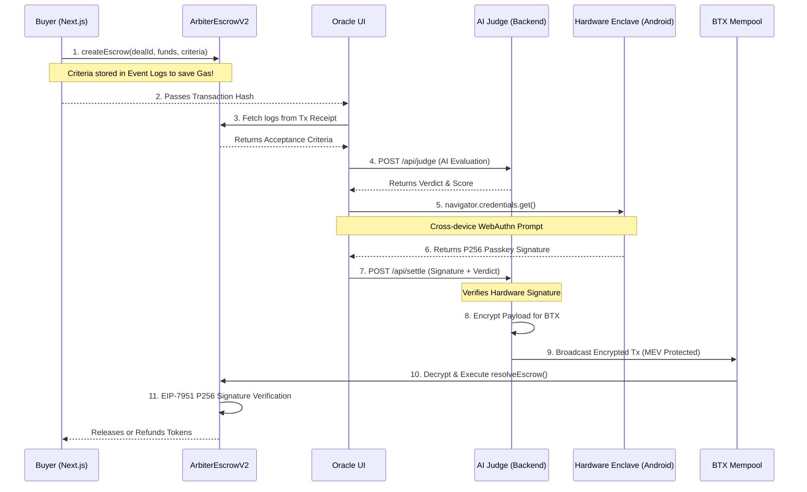

# ⚖️ Arbitra V2: The Hardware-Backed AI Oracle & Escrow Protocol

> **A production-ready AI Escrow Protocol utilizing Monad's EIP-7951 P256 Precompile, WebAuthn Hardware Enclaves, and BTX MEV Protection.**

[](https://opensource.org/licenses/MIT)
[](https://monad.xyz)
[](https://fidoalliance.org/)
[](https://soliditylang.org/)
[](https://nextjs.org/)

Arbitra V2 is a massive architectural upgrade to the original Arbitra protocol. It transitions from a purely trust-minimized backend oracle to a **Hardware-Backed, MEV-Protected AI Settlement Engine**. 

By leveraging Monad's high-performance parallel execution and the **EIP-7951 P256 Precompile**, Arbitra V2 completely removes the risk of compromised backend operator keys by requiring a cryptographic signature from a physical hardware secure enclave (like an Android phone or YubiKey) before *any* AI verdict is finalized on-chain.

---

## 🧭 The Hardware-Backed Architecture



---

## 🎯 What's New in V2?

### 1. 📱 WebAuthn Passkeys & The P256 Precompile
In V1, if the backend server was compromised, the attacker could use the hot wallet private key to drain escrows. 
In V2, the Smart Contract requires a **secp256r1 (P256)** signature natively verified on-chain via Monad's EIP-7951 precompile. The Oracle backend **cannot** broadcast a settlement without a live biometric signature from the Admin's Android Secure Enclave.

### 2. 🛡️ BTX (Blockaid Transaction) MEV Protection
AI Oracle settlements are prime targets for front-running. V2 implements a threshold-encryption architecture. The backend locally encrypts the signed transaction payload before submitting it to the BTX mempool. The transaction remains completely obfuscated until it is proposed in a block, guaranteeing MEV protection.

### 3. ⛽ Gas-Optimized Event Storage
Strings are expensive to store on-chain. V2 completely refactored the `ArbiterEscrowV2` contract to omit the `acceptanceCriteria` from the struct state. Instead, it is emitted in the `EscrowCreated` event log. The Oracle Dashboard dynamically parses the Transaction Receipt logs to retrieve the criteria, achieving a trustless architecture with near-zero storage costs.

### 4. 🎨 Next.js Dashboard
A brand new, dark-themed, highly polished Next.js frontend built with Tailwind CSS, Framer Motion, and Ethers v6. It features split `Buyer` and `Oracle` interfaces specifically designed for seamless hackathon demonstrations.

---

## 🔐 The Smart Contract Security Model

The `ArbiterEscrowV2.sol` contract enforces strict cryptographic boundaries:

```solidity
// 1. Secure Payload Hash (Prevents Cross-Chain & Cross-Contract Replay)
bytes32 payloadHash = sha256(
    abi.encode(
        block.chainid,
        address(this),
        dealId,
        success,
        score,
        keccak256(bytes(reasoning))
    )
);

// 2. Verify Hardware Passkey Signature using Monad's EIP-7951 Precompile
bytes memory input = abi.encodePacked(payloadHash, r, s, oraclePubKeyX, oraclePubKeyY);
(bool callSuccess, bytes memory returnData) = address(0x0100).staticcall(input);
require(callSuccess && abi.decode(returnData, (uint256)) == 1, "Invalid Hardware Signature");
```

---

## 🚀 To Run The Project

Want to run the full flow locally? 

### Prerequisites
- Node.js 20+
- A WebAuthn-capable device (Desktop Chrome with Windows Hello/TouchID, or Android via cross-device QR code).

### 1. Start the Environment
```bash
# Terminal 1: Start the Backend (Handles AI Judging & BTX Relaying)
cd backend
npm install
npm run backend

# Terminal 2: Start the Frontend
cd frontend
npm install
npm run dev
```

### 2. The Buyer Flow
1. Open your **Desktop Chrome Browser** to `http://localhost:3001/buyer`.
2. Connect MetaMask (Automatically switches to Monad Testnet).
3. Fill out the form and click **Deploy & Fund Escrow**.
4. Approve the two transactions.
5. Click **Copy Transaction Hash**.

### 3. The Oracle Flow
1. Open a new tab to `http://localhost:3001/oracle`.
2. Click **Register Hardware**. Select *"Use a phone or tablet"* in the Chrome popup to scan a QR code and register your Android device as the secure enclave.
3. Paste the **Transaction Hash** you copied from the Buyer. The UI will instantly fetch and lock the Acceptance Criteria from the blockchain logs!
4. Click **Run AI Evaluation**.
5. Click **Hardware Sign & Broadcast**. Chrome will prompt you for your biometric fingerprint. Once authorized, the backend encrypts the payload and settles the deal on Monad!

---

## 🧰 V2 Tech Stack

- **Network:** Monad Testnet
- **Smart Contracts:** Solidity 0.8.20 + Hardhat
- **Frontend:** Next.js App Router, Tailwind CSS, Framer Motion, Lucide Icons
- **Web3 Interaction:** Ethers.js v6
- **Cryptography:** `@simplewebauthn/browser` & `@simplewebauthn/server` for COSE/CBOR parsing, AES-256-GCM for BTX mempool encryption mock.
- **AI Integration:** Google Gemini / OpenAI via custom backend orchestration.
